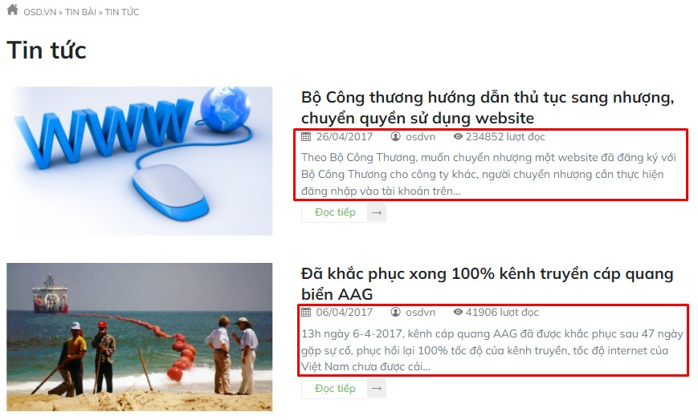

# Chuyên mục tin bài

- Chuyên mục tin bài: cho phép tạo nhiều nhóm những chuyên mục cùng loại với nhau tùy theo mục đích.
- Một chuyên mục tin bài có liên kết mật thiết chặt chẽ với các tin bài cùng loại.

## Thêm chuyên mục tin bài

Nhấn chọn **Nội dung -> Nhóm và danh mục -> Chuyên mục tin**. Nhấn chọn nút **Thêm** để thêm mới 1 mục.

Những thông tin cụ thể cần điền như sau:

*Chú ý: Bạn bắt buộc phải nhập tên nhóm tin bài trước khi có thể lưu lại thông tin.*

**Tên chuyên mục**

Điền tên nhóm chuyên mục. Mỗi nhóm chuyên mục tin được tạo sẽ có 1 đường dẫn địa chỉ website, tại URL đó sẽ hiển thị những tin bài mà bạn đã thêm vào

**Phụ đề**

Điền phụ đề cho chuyên mục tin bài (nếu có). Được hiển thị dưới tiêu đề chuyên mục tin bài tùy từng giao diện.

**Mô tả**

Điền nội dung mô tả cho chuyên mục tin bài

**Hình ảnh**:

Nhấn chọn **Chọn ảnh đại diện**, sau đó chọn thư mục ảnh tương ứng để upload ảnh lên trình quản lý file.

**Cấp danh mục cha**:

Chọn danh mục cấp cha cho danh mục này nếu danh mục này không có danh mục cha thì sẽ là danh mục lớn nhất. Bạn nhập tên nhóm chuyên mục tin, hệ thống gợi ý tên danh mục để bạn lựa chọn

**Hiển thị ngày đăng tin**

Tích vào trường thông tin này, khi xem ngoài website hệ thống sẽ lấy thông tin ngày đăng tin bài hiển thị dưới tiêu đề tin bài

**Hiện tác giả**

Tích vào trường thông tin này, khi xem ngoài website hệ thống sẽ lấy thông tin tác giả đăng tin bài đó và được hiển thị dưới tiêu đề tin bài

**Hiện lượt xem**

Tích vào trường thông tin này, khi xem ngoài website hệ thống sẽ tất cả lượt xem của tin bài và được hiển thị dưới tiêu đề tin bài

**Hiển thị chapeau**

Tích vào trường thông tin này, khi xem ngoài website hệ thống sẽ lấy thông tin mô tả ngắn (sapo) của tin bài và được hiển thị dưới tiêu đề tin bài

4 tùy chọn trên hiển thị tại nhóm chuyên mục tin. Hình minh họa cấu hình 4 tùy chọn trên

**Kích thước ảnh**

Có 5 loại kích thước có sẵn để lựa chọn

**Tỷ lệ**

Có 4 loại kích thước có sẵn để lựa chọn

**Mẫu trình bày**

Tại đây có 5 kiểu trình bày cho bạn lựa chọn

- **Mặc định**: hiển thị theo hàng dọc
- **Tạp chí**: hiển thị 3 bài trên 1 hàng ngang
- **Khối**: hiển thị giống tạp chí và các bài được nổi bật theo khối
- **Thư viện video**:

**Thứ tự**

Xem thêm [tại đây](https://mkmate.osd.vn/docs/common/logic/#th%E1%BB%A9-t%E1%BB%B1-s%E1%BA%AFp-x%E1%BA%BFp-l%C3%A0-s%E1%BB%91-ch%E1%BB%89-%C4%91%E1%BB%8Bnh)

**Xuất bản**

Xem thêm [tại đây](https://mkmate.osd.vn/docs/common/logic#tr%E1%BA%A1ng-th%C3%A1i-v%C3%A0-xu%E1%BA%A5t-b%E1%BA%A3n)

**_SEO_**

Nhấp vào icon bút chì để tối ưu các công cụ tìm kiếm bao gồm Meta title, Meta keyword, Meta Description.

Xem [tại đây](https://mkmate.osd.vn/docs/seo/serp)

Nhấn chọn nút **Lưu** để lưu lại 1 mục.

## Xóa nhóm chuyên mục tin bài

Chọn **Xóa** từ danh sách checkbox bên phải hoặc nhấn chọn nút **Xóa chuyên mục** trong mỗi chuyên mục tin bài chi tiết.

Xem thêm [tại đây](https://mkmate.osd.vn/docs/common/logic#x%C3%B3a-c%C3%A1c-m%E1%BB%A5c-c%C3%A1c-th%C3%A0nh-ph%E1%BA%A7n-th%C3%B4ng-tin)

## Sửa nhóm chuyên mục tin bài

Nhấp chọn trực tiếp vào nhóm chuyên mục tin bài cần sửa.

Sau khi thay đổi các thông tin nội dung của bài viết cần chọn nút **Lưu** để cập nhật những thay đổi.
