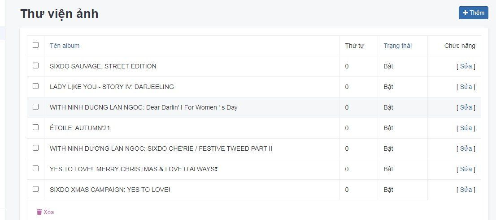
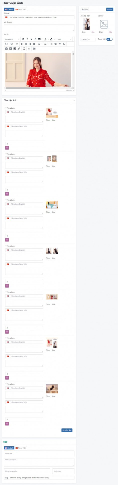
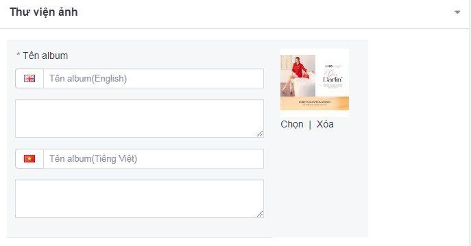

# Quản lý Thư viện ảnh

## Thêm thư viện ảnh

**Bước 1** Tại màn hình quản trị, bạn chọn menu **Nội dung -> Thư viện ảnh**

**Bước 2** Nhấp chuột vào **Thêm**

**Bước 3** Trang tạo thư viện ảnh mới được mở ra, điền các thông tin chi tiết của nhóm thư viện ảnh đó.

**Tiêu đề** Tên các bộ sưu tập ảnh sản phẩm muốn hiển thị

**Mô tả ngắn** Nội dung mô tả ngắn gọn cho thư viện ảnh hoặc upload ảnh bộ sưu tập

**Mô tả** Nội dung chi tiết thư viện ảnh cho người đọc (nếu có)

**Thư viện ảnh** Upload các bộ ảnh trình bày kiểu gallery

*   **Tên album (English)**: nhập tên cho mỗi ảnh trong bộ sưu tập
*   **Nội dung**: mô tả ảnh trong bộ sưu tập (nếu có)
*   **Tên album (Tiếng Việt)**: nhập tên cho mỗi ảnh trong bộ sưu tập
*   **Nội dung**: mô tả ảnh trong bộ sưu tập (nếu có)
*   **Thêm ảnh**: click để thêm nhiều ảnh trong cùng bộ sưu tập

**Ảnh đại diện** Nhấn chọn **Chọn** để lựa chọn tập tin hình ảnh của bộ sưu tập từ máy tính và tải lên

**Banner** Nhấn chọn **Chọn** để lựa chọn tập tin hình ảnh của bộ sưu tập từ máy tính và tải lên

**Thứ tự** Đánh thứ tự hiển thị của mỗi bộ sưu tập (với số 0 là số lớn nhất được hiển thị đầu tiên)

**Trạng thái** Lựa chọn trạng thái hiển thị cho mỗi bộ sưu tập ảnh (Bật: cho phép hiển thị/Tắt: không cho phép hiển thị)

**Slug** Giá trị này tự động được sinh ra trùng với tên tiêu đề (không cần thay đổi nếu không bị trùng lặp nếu đã có một giá trị trước đó, **Slug** không chứa kí tự đặc biệt, không viết cách, không có khoảng trống và các chữ được phân cách nhau bởi dấu "-")

_**Chú ý**: cần nhập nội dung tab tiếng Anh và nội dung tab tiếng Việt (nếu có)_