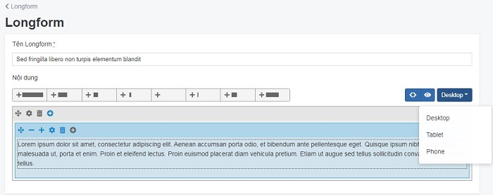
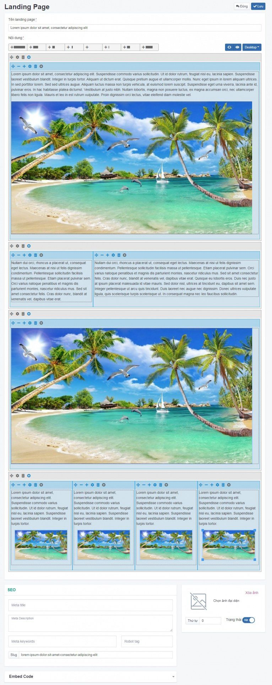
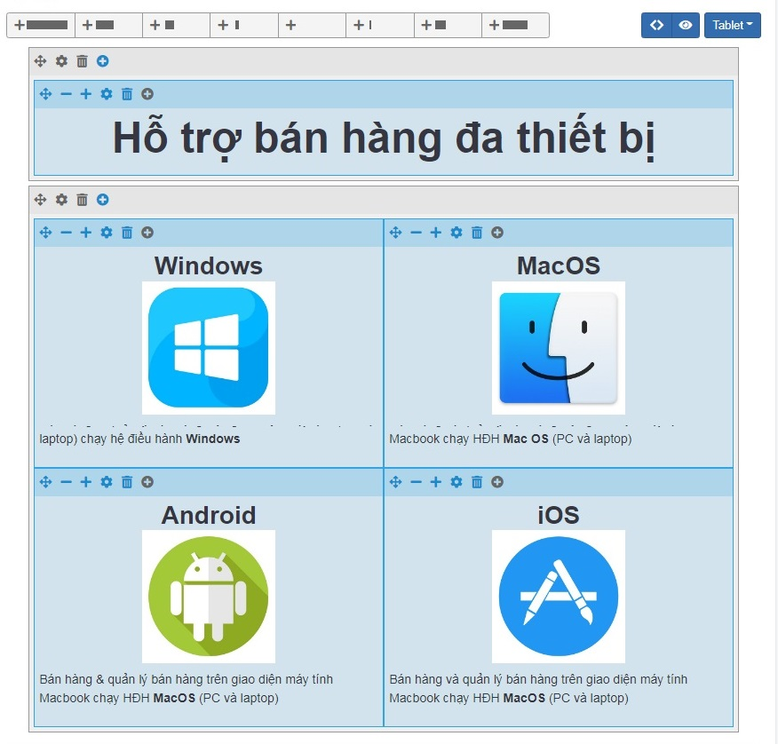
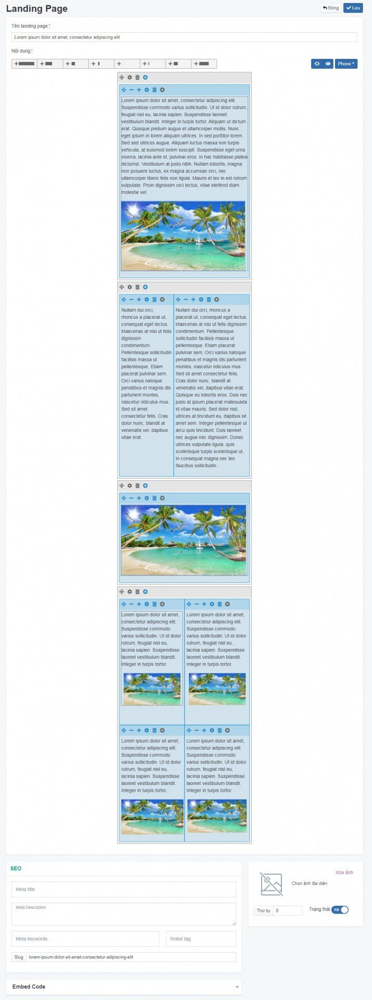
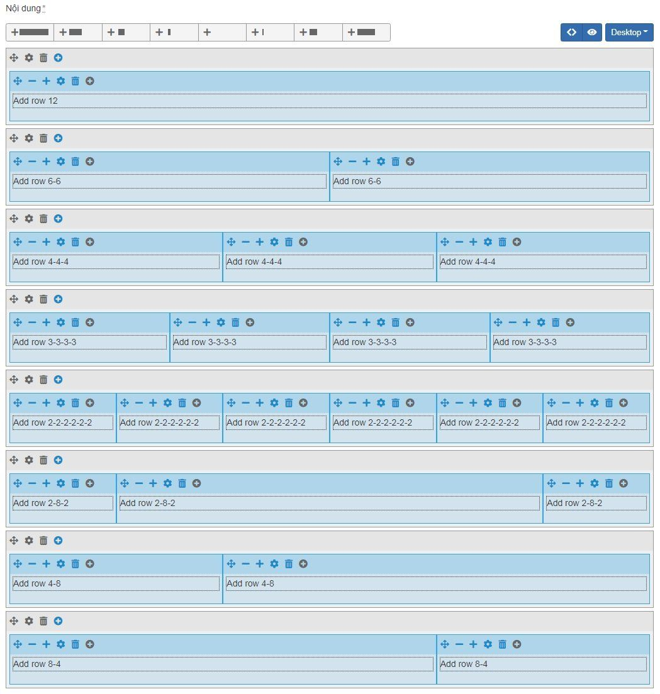

# Quản lý Long Form

Longform là định dạng thể hiện kiểu tạp chí với đồ hoạ đẹp, hình ảnh chất lượng cao. Độc giả có thể tìm thấy chân dung nhân vật, các vấn đề thời sự, một cuộc điều tra hay các trải nghiệm cá nhân.

## Thêm mới Long Form

Tại đây bạn có thể quản lý các bài long form.

**Bước 1** Tại màn hình quản trị, bạn chọn mục **Nội dung -> Long Form**

**Bước 2** Nhấp chuột vào nút **Thêm**

**Bước 3** Trang tạo landingpage mới được mở ra, điền các thông tin chi tiết của bài thông tin đó.

Bạn thêm các bài long form theo nhiều định dạng form khác nhau. Bạn có thể tùy chỉnh 3 phiên bản **Desktop, Tablet, Mobile,** nhấn chọn vào danh sách thả xuống và chọn phiên bản **Desktop, Tablet, Mobile** tương ứng, sau đó nhấn chọn dấu cộng tại mỗi hàng để tùy chỉnh kích thước mỗi box tương ứng hiển thị trên màn hình.

Tùy chỉnh màn hình Desktop:

Tùy chỉnh màn hình Tablet:

Tùy chỉnh màn hình Mobile:

Taị đây bạn có thể thêm, sửa, xóa bài long form:

**Tên landing page** Tiêu đề là một phần quan trọng hàng đầu của bài viết. Tiêu đề quyết định đến số lượng người truy cập bài viết của bạn bởi nó là phần đầu tiên trong bài viết tiếp cận đến người đọc, nó mang sứ mệnh thu hút và kích thích sự tò mò, ý muốn khám phá bài viết ở người đọc.

**Nội dung** Mô tả chi tiết bài thông tin để người dùng hiểu rõ hơn về lĩnh vực của bạn đang kinh doanh. Có 8 loại tab nội dung theo 8 cách hiển thị khác nhau như sau:

- Add row 12
- Add row 6-6
- Add row 4-4-4
- Add row 3-3-3-3
- Add row 2-2-2-2-2-2
- Add row 2-8-2
- Add row 4-8
- Add row 8-4

Hình minh họa mỗi tab được hiển thị lần lượt như sau:

**Ảnh đại diện** Nhấp chọn ảnh để lựa chọn tập tin hình ảnh bài thông tin và tải lên (nếu có)

**Meta title** Tự động lấy từ Tiêu đề, khi Meta title không khác tiêu đề thì bạn không cần điền

**Meta Description** Tự động lấy từ Sapo, khi Meta Description không khác sapo thì bạn không cần điền

**Slug** Giá trị này tự động được sinh ra trùng với tên tiêu đề bài long form (không cần thay đổi nếu không bị trùng lặp nếu đã có một giá trị trước đó, Slug không chứa kí tự đặc biệt, không viết cách, không có khoảng trống và các chữ được phân cách nhau bởi dấu “-“)

**Trạng thái** Lựa chọn trạng thái hiển thị bài long form (Bật: cho phép hiển thị/Tắt: không cho phép hiển thị)

**Thứ tự** Đánh thứ tự hiển thị của bài thông tin (với số 0 là số lớn nhất được hiển thị đầu tiên)

Sau khi hoàn tất các thao tác để thêm mới bài thông tin, đừng quên ấn nút **Lưu** nhé.

## Xóa Long From

### Xóa 1 bài Long Form

Tích chọn bài bạn muốn xóa tại danh sách bài Long Form và chọn Xóa. Hệ thống xác nhận bạn có chắc chắn muốn xóa không với nội dung như sau **Xóa bỏ là hành động sẽ không phục hồi lại được dữ liệu! Bạn có chắc chắn muốn thực hiện việc này?** Bạn chọn **OK**

### Xóa 1 cột nội dung trong bài Long Form

Nhấn chọn icon thùng rác tại mỗi cột nội dung. Hệ thống xác nhận bạn có chắc chắn muốn xóa với nội dung như sau **Delete column?** Bạn chọn **Ok**

## Sửa bài Long Form

Nhấn chọn bài Long Form cần sửa, sau khi thay đổi thông tin tại các trường trong bài, bạn cần nhấn **Lưu** để cập nhật.
