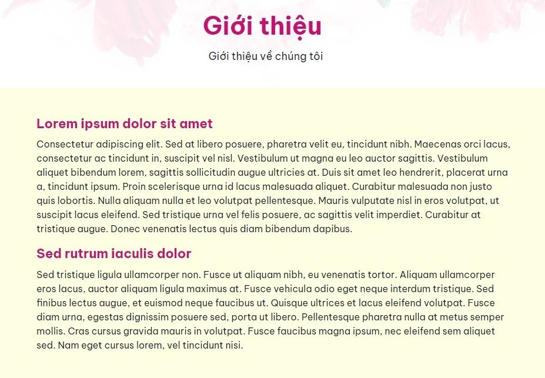

# Quản lý Thông tin

Cho phép quản lý các bài thông tin như bài giới thiệu, các bài viết về chính sách công ty

Hình minh họa hiển thị ngoài website:

## Thêm mới bài thông tin

Tại đây bạn có thể quản lý các bài thông tin.

**Bước 1** Tại màn hình quản trị, bạn chọn mục **Nội dung -> Thông tin**

**Bước 2** Nhấp chuột vào nút **Thêm**

**Bước 3** Trang tạo thông tin mới được mở ra, điền các thông tin chi tiết của bài thông tin đó.

Bạn thêm các bài thông tin như Giới thiệu, các chính sách của công ty,...

**Tiêu đề** Là một phần quan trọng hàng đầu của bài viết. Tiêu đề quyết định đến số lượng người truy cập bài viết của bạn bởi nó là phần đầu tiên trong bài viết tiếp cận đến người đọc, nó mang sứ mệnh thu hút và kích thích sự tò mò, muốn khám phá bài viết ở người đọc.

**Phụ đề** Được hiển thị dưới tên tiêu đề bài thông tin. (ví dụ: Giới thiệu về chúng tôi). Hình minh họa dưới đây

**Mô tả** Mô tả chi tiết bài thông tin để người dùng hiểu rõ hơn về lĩnh vực của bạn đang kinh doanh.

**Ảnh đại diện** Nhấp chọn ảnh để lựa chọn tập tin hình ảnh bài thông tin và tải lên (nếu có)

**Meta title** Tự động lấy từ Tiêu đề, khi Meta title không khác tiêu đề thì bạn không cần điền

**Meta Description** Tự động lấy từ Sapo, khi Meta Description không khác sapo thì bạn không cần điền

**SEO URL** Giá trị này tự động được sinh ra trùng với tên tiêu đề (không cần thay đổi nếu không bị trùng lặp nếu đã có một giá trị trước đó, SEO URL không chứa kí tự đặc biệt, không viết cách, không có khoảng trống và các chữ được phân cách nhau bởi dấu “-“), giá trị này có thể sẽ được dùng là đường dẫn liên kết trong các menu

**Trạng thái** Lựa chọn trạng thái hiển thị bài thông tin (Bật: cho phép hiển thị/Tắt: không cho phép hiển thị)

**Thứ tự** Đánh thứ tự hiển thị của bài thông tin (với số 0 là số lớn nhất được hiển thị đầu tiên)

Sau khi hoàn tất các thao tác để thêm mới bài thông tin, đừng quên ấn nút **Lưu** nhé.

## Xóa bài thông tin

Để xóa một bài viết thông tin, tích vào bài viết thông tin đó và chọn **Xóa** hoặc click trường **Xóa bài** trong mỗi bài thông tin chi tiết.

## Sửa bài thông tin

Để sửa một bài viết thông tin, nhấn chọn vào bài thông tin đó để sửa, sau khi thay đổi các thông tin - thiết lập của bài viết tin cần chọn **Lưu** để lưu lại những thay đổi.
