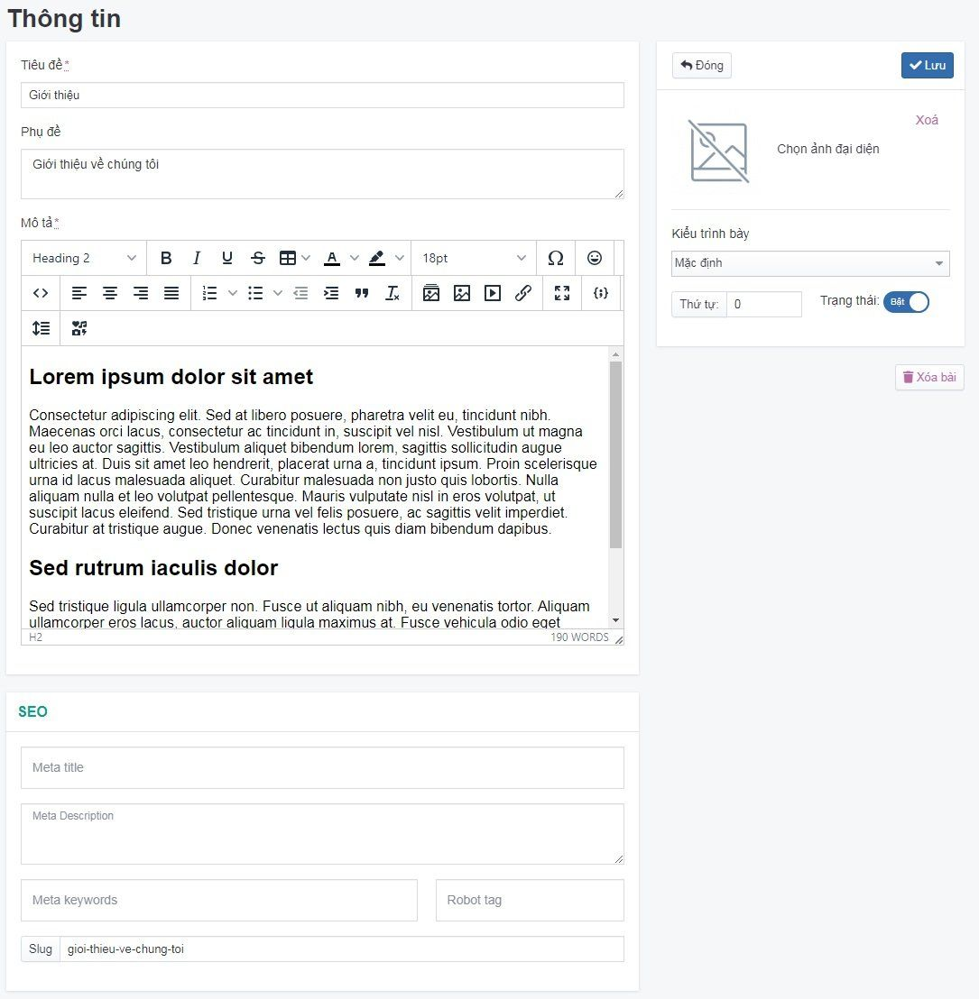

# Quản lý Thông tin

Cho phép quản lý các bài thông tin như bài giới thiệu, các bài viết về chính sách công ty.

## Thêm mới bài thông tin

Tại đây bạn có thể quản lý các bài thông tin.

1. Tại màn hình quản trị, bạn chọn mục **Nội dung -> Thông tin -> Thêm**

2. Trang tạo thông tin mới được mở ra, điền các thông tin chi tiết của bài thông tin đó.

Bạn thêm các bài thông tin như Giới thiệu, các chính sách của công ty,...

Những thông tin cụ thể cần điền như sau:

**Tiêu đề** Là một phần quan trọng hàng đầu của bài viết. Tiêu đề quyết định đến số lượng người truy cập bài viết của bạn bởi nó là phần đầu tiên trong bài viết tiếp cận đến người đọc, nó mang sứ mệnh thu hút và kích thích sự tò mò, muốn khám phá bài viết ở người đọc.

**Phụ đề** Được hiển thị dưới tên tiêu đề bài thông tin.

**Mô tả** Mô tả chi tiết bài thông tin để người dùng hiểu rõ hơn về lĩnh vực của bạn đang kinh doanh.

**Ảnh đại diện** Nhấp chọn ảnh để lựa chọn tập tin hình ảnh bài thông tin và tải lên

_Chỉnh sửa SEO để tối ưu trên các công cụ tìm kiếm bao gồm Meta title, Meta keyword, Meta Description_

Xem [tại đây](https://mkmate.osd.vn/docs/common/seo)

**Trạng thái** Lựa chọn trạng thái hiển thị bài thông tin (Bật: cho phép hiển thị/Tắt: không cho phép hiển thị)

**Thứ tự** Đánh thứ tự hiển thị của bài thông tin (với số 0 là số lớn nhất được hiển thị đầu tiên)

Nhấp chuột vào nút **Lưu** để hoàn tất.

## Xóa bài thông tin

Để xóa một bài viết thông tin, tích vào bài viết thông tin đó và chọn **Xóa** từ danh sách bên trái hoặc click trường **Xóa bài** trong mỗi bài thông tin chi tiết.

## Sửa bài thông tin

Để sửa một bài viết thông tin, nhấn chọn vào bài thông tin đó để sửa, sau khi thay đổi các thông tin - thiết lập của bài viết tin cần chọn **Lưu** để lưu lại những thay đổi.
