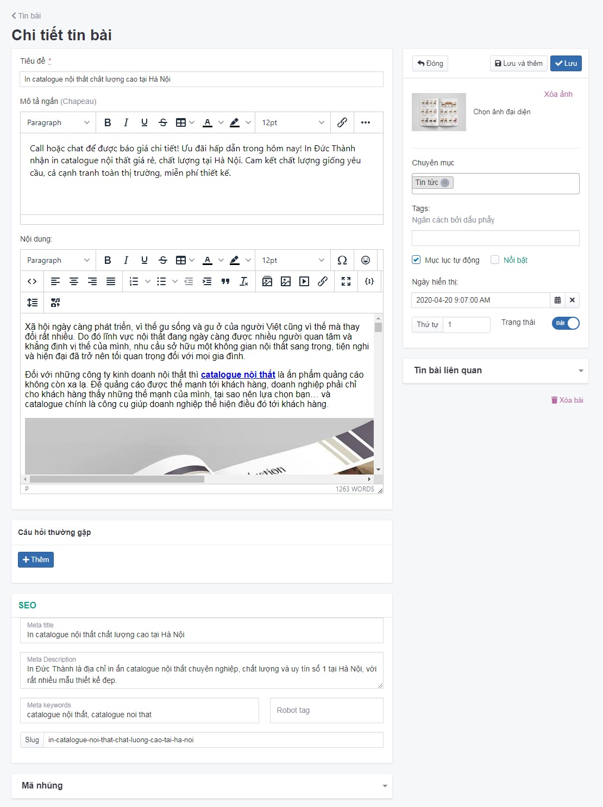

# Quản lý tin bài

## Thêm bài tin mới

1. Tại màn hình quản trị, bạn chọn **Nội dung -> Tin bài**

2. Nhấp chuột vào nút **Thêm**

3. Trang tạo tin bài mới được mở ra, nhập thông tin các trường tin bài bao gồm:

Những thông tin cụ thể cần điền như sau:

**Tiêu đề** Nhập tên bài tin bạn muốn hiển thị trên wesbite

**Mô tả ngắn (Chapeau)** Là phần nội dung mở đầu của một nhóm chuyên mục, nhằm giới thiệu hoặc tóm tắt nội dung ngắn gọn, cô đọng, xúc tích, tạo ra trong bản tin một nhịp điệu giữa các chủ đề bài dịch vụ. Được hiển thị phía trên danh sách các bài dịch vụ

**Nội dung** Nội dung bài tin cần phải chất lượng, cung cấp đầy đủ thông tin hữu ích, tạo niềm tin cho người đọc. Đặc biệt bạn chú ý tối ưu đầy đủ các yếu tố kỹ thuật SEO (nếu website bạn quan tâm đến SEO)

Bạn có thể tham khảo thêm bài viết kỹ thuật (hướng dẫn) viết bài chuẩn SEO đạt kết quả cao.

**Câu hỏi thường gặp**

Xem [tại đây](https://mkmate.osd.vn/docs/catalog/faq)

**Hình ảnh** Nhấp chọn ảnh để lựa chọn tập tin hình ảnh tin bài và tải lên

**Chuyên mục** Bạn có thể thêm tin bài vào nhiều danh mục khác nhau. Nhấn chọn trường “Chuyên mục” và lựa chọn chuyên mục tin bạn muốn thêm tin bài đó vào.

**Tag** Nhập từ khóa cho bài tin và ngăn cách nhau bằng dấu phẩy

**Mục lục tự động** Được hiển thị mục lục phía trên đầu nội dung bài viết theo heading được cấu hình trong nội dung trình soạn thảo

**Ngày hiển thị** Lựa chọn ngày hiển thị cho tin bài

**Trạng thái** Lựa chọn trạng thái hiển thị tin bài (Bật: cho phép hiển thị/Tắt: không cho phép hiển thị)

**Thứ tự** Đánh thứ tự hiển thị của tin bài(với số 0 là số lớn nhất được hiển thị đầu tiên)

**Tin bài** liên quan Bạn cần gõ tên bài cụ thể hoặc gõ số 0 hệ thống sẽ lọc list danh sách cho bạn lựa chọn bài phù hợp

Chỉnh sửa SEO để tối ưu trên các công cụ tìm kiếm bao gồm Meta title, Meta keyword, Meta Description.

Xem **tại đây**

Sau khi hoàn tất các thao tác để thêm mới tin bài, đừng quên ấn nút Lưu nhé.

## Xóa một tin bài

**Cách 1:** Xóa bài tin tại menu thả danh sách xuống bên trái

Nhấn tích vào tin bài đó và chọn **Xóa**.

Hệ thống xác nhận bạn có chắc chắn muốn xóa không với nội dung như sau **Xóa bỏ là hành động sẽ không phục hồi lại được dữ liệu! Bạn có chắc chắn muốn thực hiện việc này?**. Bạn chọn **OK**

**Cách 2:** Xóa tại bài tin chi tiết

Truy cập vào bài tin chi tiết, tại góc phải màn hình bạn nhấn chọn tab Xóa bài. Hệ thống xác nhận bạn có chắc chắn muốn xóa không với nội dung như sau **Xóa bỏ là hành động sẽ không phục hồi lại được dữ liệu! Bạn có chắc chắn muốn thực hiện việc này?**. Bạn chọn **OK**

## Sửa một tin bài

Nhấp chọn nút 3 chấm cuối bài tin, nhấn chọn **Sửa** ở tin bài đó hoặc nhấn chọn trực tiếp tại bài tin muốn sửa, sau khi thay đổi các thông tin - thiết lập của bài viết cần chọn **Lưu** để hoàn tất.
