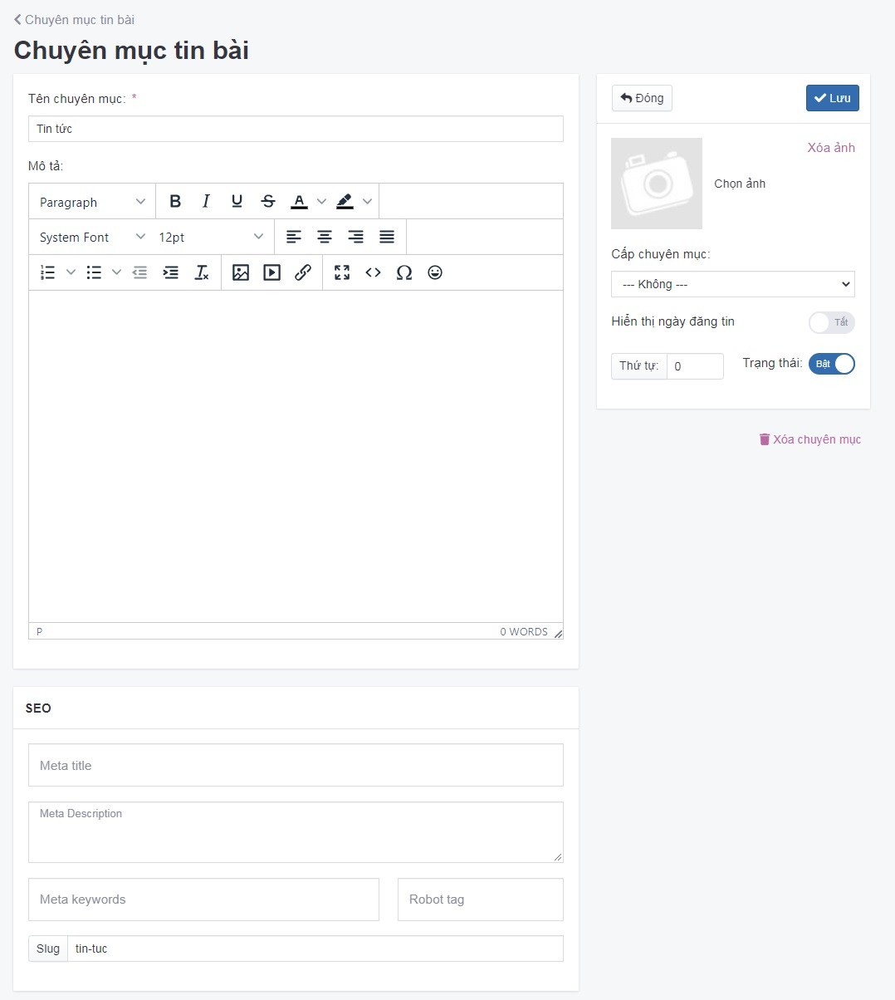

# Quản lý nhóm tin bài

## Thêm nhóm tin bài

Để thêm một nhóm chuyên mục bài tin, bạn cần:

Tại màn hình quản trị, bạn chọn mục **Nội dung -> Nhóm và dịch vụ -> Chuyên mục tin**

Nhấp chuột vào nút **Thêm**

Trang tạo nhóm chuyên mục tin bài mới được mở ra, điền các thông tin chi tiết của nhóm tin bài đó.

Chú ý: Bạn bắt buộc phải nhập tên nhóm tin bài trước khi có thể lưu lại thông tin.

Những thông tin cụ thể cần điền như sau:

**Nhóm chuyên mục** Tên nhóm chuyên mục có thể xuất hiện trên thanh công cụ Topmenu của website, khi người đọc click nhóm chuyên mục sẽ được chuyển hướng tới trang danh sách các bài tin có trong nhóm chuyên mục này. Cần đặt tên nhóm chuyên mục hấp dẫn, kích thích người đọc nhìn là muốn click ngay.
Khi bạn thêm mới bài tin, bạn cần chọn 1 nhóm chuyên mục tương ứng để giúp người đọc phân biệt rõ ràng mỗi loại chuyên mục trên website. (ví dụ: Tin tức)

**Mô tả** Là phần nội dung mở đầu của một nhóm chuyên mục, nhằm giới thiệu hoặc tóm tắt nội dung ngắn gọn, cô đọng, xúc tích, tạo ra trong bản tin một nhịp điệu giữa các chủ đề bài tin.

**Hình ảnh** Tải ảnh đại diện cho nhóm tương ứng (nếu có). Ảnh này thông thường sẽ dùng để hiển thị khi chia sẻ mạng xã hội.

**Cấp nhóm** Chọn danh mục cha cho danh mục này nếu không danh mục này sẽ là danh mục lớn nhất

**Thứ tự** Nhập số thứ tự hiển thị của danh mục (với số 0 là số lớn nhất được hiển thị đầu tiên)

**Trạng thái** Lựa chọn trạng thái hiển thị cho danh mục (Bật_màu xanh: cho phép hiển thị/Tắt_màu xám: không cho phép hiển thị)

Nhấp chuột vào nút **Lưu** để hoàn tất

## Xóa nhóm danh mục tin bài

Trong màn hình quản trị danh sách danh mục nhóm chuyên mục, tích vào danh mục muốn xóa bỏ chọn Xóa

Hệ thống xác nhận bạn có chắc chắn muốn xóa không với nội dung như sau **Xóa bỏ là hành động sẽ không phục hồi lại được dữ liệu! Bạn có chắc chắn muốn thực hiện việc này?** Bạn chọn **OK**

## Sửa nhóm danh mục tin bài

Nhấp chọn trực tiếp vào nhóm chuyên mục cần sửa hoặc nhấn vào icon bút chì. Trang nhóm chuyên mục tin bài được mở ra, bạn sửa các thông tin cần thiết, sau đó chọn **Lưu** để hoàn tất

