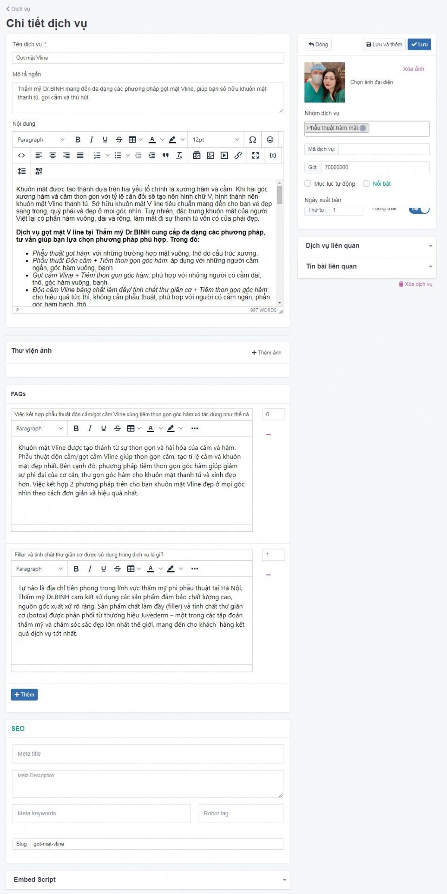

# Quản lý nhóm dịch vụ

- Nhóm dịch vụ: cho phép tạo nhiều nhóm những dịch vụ cùng loại với nhau tùy theo mục đích.
- Một nhóm dịch vụ có liên kết mật thiết chặt chẽ với các dịch vụ cùng loại.

## Thêm một nhóm dịch vụ bạn cần:

**Bước 1** Tại màn hình quản trị, bạn chọn menu **Nội dung -> Nhóm và danh mục -> Nhóm dịch vụ**

**Bước 2** Nhấp chuột vào **Thêm**

**Bước 3** Trang tạo nhóm dịch vụ mới được mở ra, điền các thông tin chi tiết của nhóm dịch vụ đó.

_Chú ý: Bạn bắt buộc phải nhập tên cho nhóm dịch vụ._

_Những thông tin cụ thể cần điền như sau:_

**Tên nhóm dịch vụ** Mỗi nhóm dịch vụ được tạo sẽ có 1 đường dẫn địa chỉ website, tại URL đó sẽ hiển thị những dịch vụ mà bạn đã thêm vào.

**Mô tả phía trên** Là phần nội dung mở đầu của một nhóm dịch vụ, nhằm giới thiệu hoặc tóm tắt nội dung ngắn gọn, cô đọng, xúc tích, tạo ra trong bản tin một nhịp điệu giữa các chủ đề bài dịch vụ. Được hiển thị phía trên danh sách các bài dịch vụ

**Mô tả phía dưới** Là phần nội dung mở đầu của một nhóm dịch vụ, nhằm giới thiệu hoặc tóm tắt nội dung ngắn gọn, cô đọng, xúc tích, tạo ra trong bản tin một nhịp điệu giữa các chủ đề bài dịch vụ. Được hiển thị phía dưới danh sách các bài dịch vụ

**Ảnh đại diện** Để upload được ảnh, bạn cần chọn Duyệt file, sau đó chọn thư mục ảnh tương ứng để upload ảnh lên trình quản lý file. _(Ví dụ: ảnh nhóm dịch vụ sẽ upload lên thư mục nhom-dich-vu có sẵn tại trình quản lý file hoặc bạn có thể tạo mới bằng cách nhấn chọn vào thư mục data (thư mục gốc) rồi chọn New folder, tiếp theo bạn nhập tên thư mục là nhom-dich-vu và tải ảnh dịch vụ hoặc nhóm dịch vụ lên thư mục này)_ Xem chi tiết cách upload ảnh [tại đây](../lam-chu-trinh-quan-ly-file)

**Cấp danh mục cha** Chọn danh mục cấp cha cho danh mục này nếu danh mục này không có danh mục cha thì sẽ là danh mục lớn nhất. Bạn nhập tên danh mục dịch vụ, hệ thống gợi ý tên danh mục để bạn lựa chọn _(ví dụ: Phẫu thuật thẩm mỹ)_. Hình minh họa:

**Thứ tự** Đánh thứ tự hiển thị của danh mục nhóm dịch vụ (với số 0 là số lớn nhất được hiển thị đầu tiên)

**Trạng thái** Lựa chọn trạng thái hiển thị cho nhóm dịch vụ trên website (Bật: cho phép hiển thị/Tắt: không cho phép hiển thị)

_Chỉnh sửa SEO để tối ưu trên các công cụ tìm kiếm bao gồm Meta title, Meta keyword, Meta Description_

**Meta title** Tự động lấy từ Tiêu đề, khi Meta title không khác tiêu đề thì không cần điền. Thẻ tiêu đề được hiển thị trên các trang kết quả của công cụ tìm kiếm dưới dạng tiêu đề có thể nhấp cho một kết quả nhất định và rất quan trọng đối với khả năng sử dụng, SEO và chia sẻ mạng xã hội

**Meta Description** Tự động lấy từ Sapo, khi Meta Description không khác sapo thì không cần điền. Meta description là thẻ mô tả tóm tắt nội dung của trang web, giúp công cụ tìm kiếm và người đọc có thể hiểu rõ hơn được về chủ đề trang web của bạn

**Slug** Giá trị này tự động được sinh ra trùng với tên tiêu đề nhóm dịch vụ (không cần thay đổi nếu không bị trùng lặp nếu đã có một giá trị trước đó, Slug không chứa kí tự đặc biệt, không viết cách, không có khoảng trống và các chữ được phân cách nhau bởi dấu “-“)

**Bước 4** Nhấp chuột vào nút **Lưu** để hoàn tất

## Xóa nhóm dịch vụ

**Cách 1**:

Xóa tại nhóm dịch vụ chi tiết

Truy cập nhóm dịch vụ chi tiết, bên góc phải màn hình nhấn chọn tab **Xóa nhóm dịch vụ**

**Cách 2**:

Nhấn chọn tích tại nhóm dịch vụ muốn xóa và chọn **Xóa**

Hệ thống xác nhận bạn có chắc chắn muốn xóa không với nội dung như sau **Xóa bỏ là hành động sẽ không phục hồi lại được dữ liệu! Bạn có chắc chắn muốn thực hiện việc này?** Bạn chọn **OK**

## Sửa nhóm dịch vụ

Nhấn chọn nhóm dịch vụ muốn sửa, trang nhóm dịch vụ được mở ra, bạn cần nhập nội dung cần thay thế sau đó chọn **Lưu** để hoàn tất.
