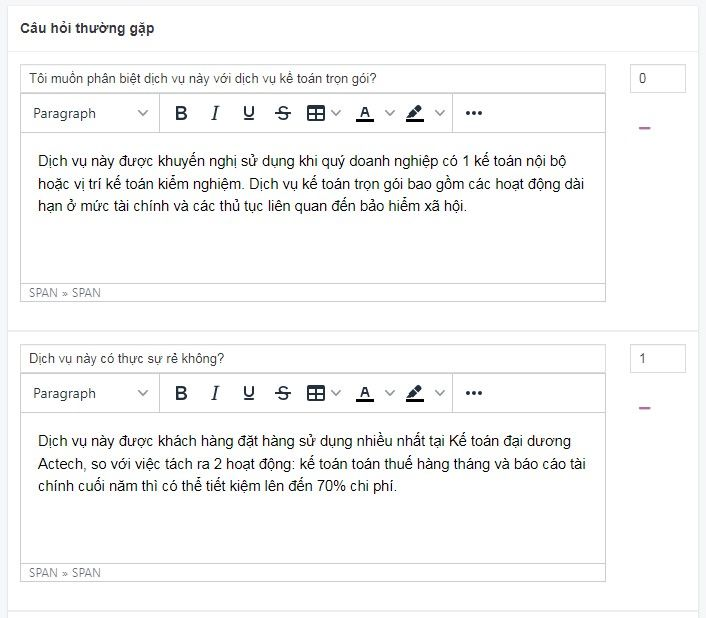

# Quản lý câu hỏi thường gặp

Câu hỏi thường gặp là các câu hỏi và trả lời thường theo cùng một chủ đề nhất định. Tập hợp những câu hỏi phổ biến thường có xu hướng được hỏi đi hỏi lại, giúp người đọc hiểu rõ hơn về dịch vụ của bạn.

## Thêm mới câu hỏi thường gặp

**Tiêu đề**
- Dựa vào mục đích của dịch vụ để đặt câu hỏi, bạn có thể sử dụng các cách thức sau:
- Hỏi thẳng vào vấn đề Những câu hỏi này chủ yếu áp dụng trong những trường hợp bạn cần câu trả lời dứt khoát hoặc cần khẳng định lại câu trả lời.
- Đưa những câu hỏi mở thăm dò Những câu hỏi này nhằm thăm dò ý kiến, khiến cho người được hỏi có thể đưa ra thêm các thông tin giải đáp những điều người đọc thường thắc mắc.

**Nội dung**
- Câu trả lời cần ngắn gọn, bám sát vào câu hỏi của chủ đề.

## Xóa câu hỏi thường gặp

Để xóa 1 tab câu hỏi thường gặp, nhấn chọn nút **Xóa** tại tab câu hỏi thường gặp đó

## Sửa câu hỏi thường gặp

Để sửa câu hỏi thường gặp, bạn thay đổi trực tiếp nội dung vào tab câu hỏi thường gặp đó và chọn **Lưu**
