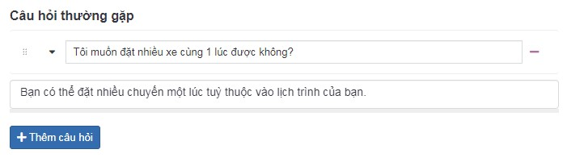
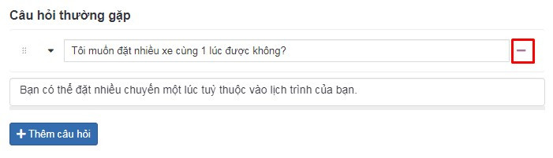
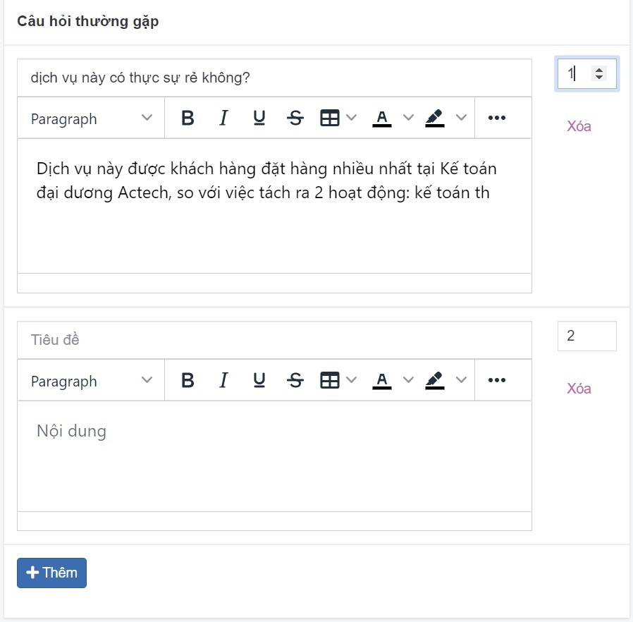

# Câu hỏi thường gặp

Tính năng này được biết đến nhiều vì lợi ích SEO, được xuất hiện trong tin bài, nhóm sản phẩm, bài dịch vụ,...

## Thêm mới câu hỏi thường gặp

Tại box "Câu hỏi thường gặp" trong từng trang, bạn có thể bấm nút **Thêm**

**Tiêu đề**

Điền tiêu đề của câu hỏi vào ô textbox

**Nội dung**

Điền nội dung câu trả lời cần ngắn gọn, xúc tích

## Xóa câu hỏi thường gặp

Để xóa 1 câu hỏi thường gặp, nhấn chọn nút **Xóa** tại câu hỏi tương ứng

## Sửa câu hỏi thường gặp

Để sửa câu hỏi thường gặp, bạn thay đổi trực tiếp nội dung vào vùng nhập văn bản

Sau khi hoàn tất các thao tác thay đổi thông tin, bạn cần chọn **Lưu** để cập nhật những thay đổi.

## Sắp xếp lại vị trí

Xem thêm [tại đây](https://mkmate.osd.vn/docs/common/logic#th%E1%BB%A9-t%E1%BB%B1-s%E1%BA%AFp-x%E1%BA%BFp-l%C3%A0-s%E1%BB%91-ch%E1%BB%89-%C4%91%E1%BB%8Bnh)
