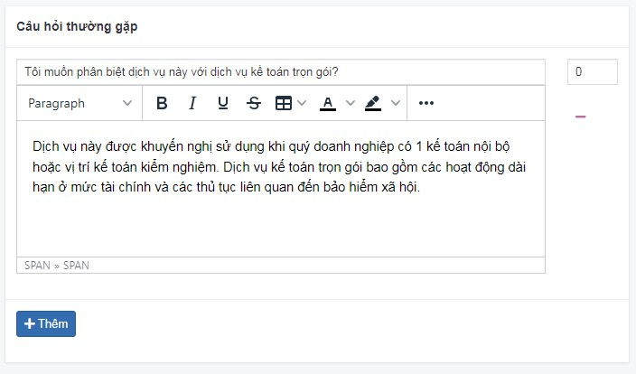
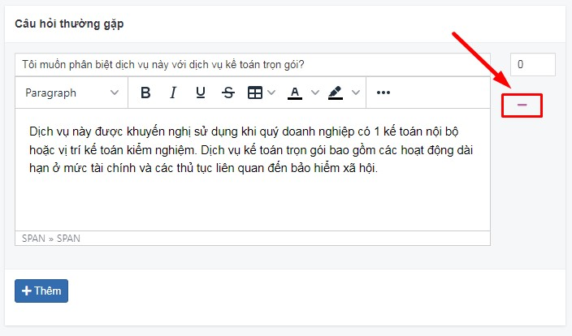
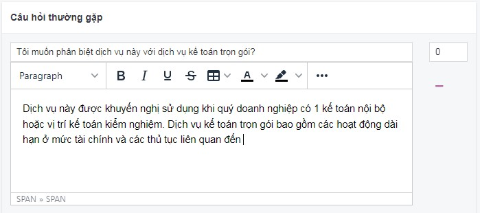

# Câu hỏi thường gặp

Tính năng này được biết đến nhiều vì lợi ích SEO, được xuất hiện trong tin bài, nhóm sản phẩm, bài dịch vụ,...

## Thêm mới câu hỏi thường gặp

Tại box "Câu hỏi thường gặp" trong từng trang, bạn có thể bấm nút **Thêm**

**Tiêu đề**

Dựa vào mục đích của sản phẩm để đặt câu hỏi, bạn có thể sử dụng các cách thức sau:

- **Hỏi thẳng vào vấn đề:** Những câu hỏi này chủ yếu áp dụng trong những trường hợp bạn cần câu trả lời dứt khoát hoặc cần khẳng định lại câu trả lời.
- **Đưa những câu hỏi mở thăm dò:** Những câu hỏi này nhằm thăm dò ý kiến, khiến cho người được hỏi có thể đưa ra thêm các thông tin giải đáp những điều người đọc thường thắc mắc.

**Nội dung**

Câu trả lời cần ngắn gọn, bám sát vào câu hỏi của chủ đề.

## Xóa câu hỏi thường gặp

Để xóa 1 câu hỏi thường gặp, nhấn chọn nút **Xóa** tại câu hỏi tương ứng

## Sửa câu hỏi thường gặp

Để sửa câu hỏi thường gặp, bạn thay đổi trực tiếp nội dung vào vùng nhập văn bản

Sau khi hoàn tất các thao tác thay đổi thông tin, bạn cần chọn **Lưu** để cập nhật những thay đổi.

## Sắp xếp lại vị trí

Xem thêm [tại đây](https://mkmate.osd.vn/docs/common/logic#th%E1%BB%A9-t%E1%BB%B1-s%E1%BA%AFp-x%E1%BA%BFp-l%C3%A0-s%E1%BB%91-ch%E1%BB%89-%C4%91%E1%BB%8Bnh)
