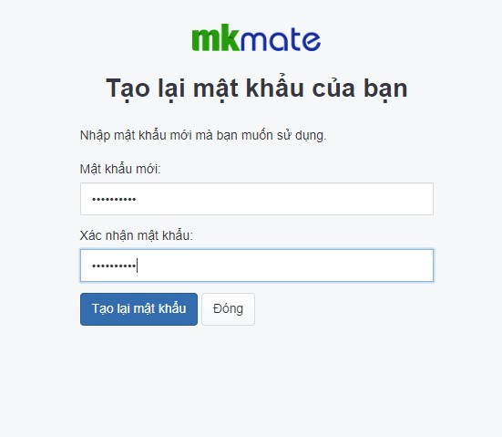

# Tạo lại mật khẩu truy cập vào khu vực quản trị

Điều kiện để chức năng này có thể hoạt động được thì trong phần hệ thống bạn cần thiết phải bật khả năng tạo mật khẩu cho thành viên.

## Bật chế độ quên mật khẩu
1. Thao tác bằng cách vào **Hệ Thống -> Thiết lập -> Bảo mật người dùng**. 
Bạn bật trạng thái của chức năng quên mật khẩu. Sau đó chọn **Lưu** để hoàn tất thiết lập. Sau khi bạn bật chức năng quên mât khẩu tại màn khi đăng nhập vào quản trị sẽ xuất hiện dưới nút đăng nhập sẽ xuất hiện dòng chữ **quên mật khẩu?**.

_Lưu ý: Tại thông tin tài khoản thành viên bạn sẽ phải điền email để khi dùng chức năng quên mật khẩu sẽ có 1 link dẫn gửi về gmail và thay đổi thông tin tài khoản có chứa email đó xem thêm [tại đây](https://mkmate.osd.vn/docs/setting/user/)._

Khi bạn quên mật khẩu quản trị website của bạn bạn có thể dùng chức năng quên mật khẩu để thay đổi thông tin mật khẩu.

## Hướng dẫn lấy lại mật khẩu khi người dùng quên mật khẩu

Tại màn hình đăng nhập bạn chọn **Quên mật khẩu?** hệ thống sẽ chuyển hướng đến trang:

Bạn điền thông tin email bạn đã đặt trong tài khoản quản trị của bạn. Tiếp đó bạn sẽ nhấn chọn **Tạo lại mật khẩu mới**.

_Ví dụ: email bạn đặt trong user quản trị là tencuaban@gmail.com bạn sẽ điền thông tin email tương ứng đó vào. _

Sau đó bạn sẽ chờ 5p -> 10p hệ thống sẽ gửi cho bạn 1 đường dẫn thay đổi mật khẩu về gmail của bạn.

_Lưu ý: nếu tài khoản email không đúng với tài khoản bạn đã thềm trong user quản trị của bạn sẽ không lấy được mật khẩu của user quản trị đó._

Tiếp đó bạn click vào đường dẫn sau đó tạo lại mật khẩu mới. Tại màn hình hiển thị như sau:

Tiếp theo bạn điền mật khẩu bạn muốn tạo vào trường **Mật khẩu mới**, sau đó nhập lại mật khẩu bạn đã điền.

_Lưu ý: 2 trường mật khẩu trên phải nhập cùng 1 mật khẩu._

Sau đó click **Tạo lại mật khẩu mới**. Sau đó hệ thống sẽ trở về màn hình đăng nhập bạn điền thông tin tài khoản và mật khẩu bạn vừa tạo lại.
