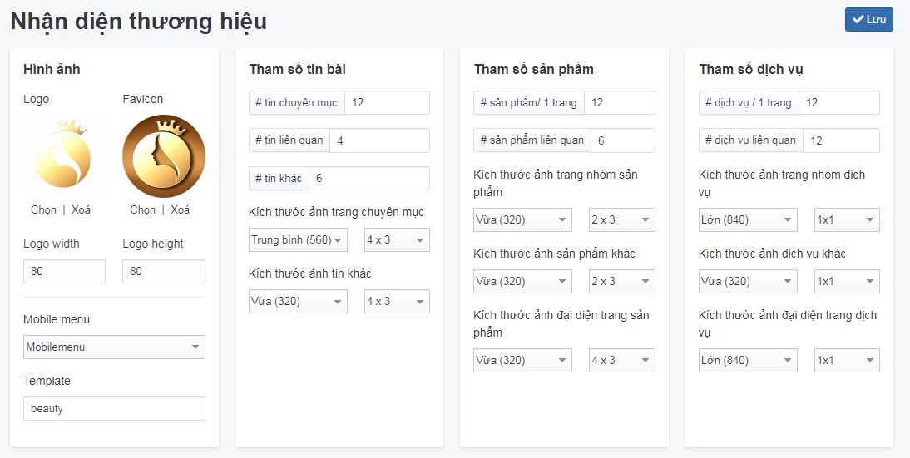

# Nhận diện

Logo sẽ giúp khách hàng nhớ đến thương hiệu của bạn dễ dàng hơn.

Logo website sẽ được hiển thị góc trái hoặc giữa màn hình. Để cấu hình logo website bạn cần:

Nhấn chọn **Giao diện -> Nhận diện**. Những thông tin - thiết lập cụ thể cần điền như sau:

**Logo**: nhấn chọn **Chọn** để tải logo từ máy tính của bạn lên trình quản lý file

**Favicon**: nhấn chọn **Chọn** để tải favicon từ máy tính của bạn lên trình quản lý file

**Chiều rộng logo**: nhập kích thước chiều rộng logo

**Chiều cao logo**: nhập kích thước chiều cao logo

**Mobile menu**: đây là cấu hình mang tính chất kỹ thuật, không được sửa phần này.

**Template**: đây là cấu hình mang tính chất kỹ thuật, không được sửa phần này.

Xem thêm cách upload ảnh [tại đây](https://mkmate.osd.vn/docs/common/finder)

Nhấp chuột vào nút **Lưu** để hoàn tất.

**Tham số tin bài, Tham số sản phẩm, Tham số dịch vụ** là phân quyền tài khoản được cấu hình sẵn mang tính kĩ thuật. Bạn cần chú ý cẩn thận trước khi sửa/xóa các quyền.