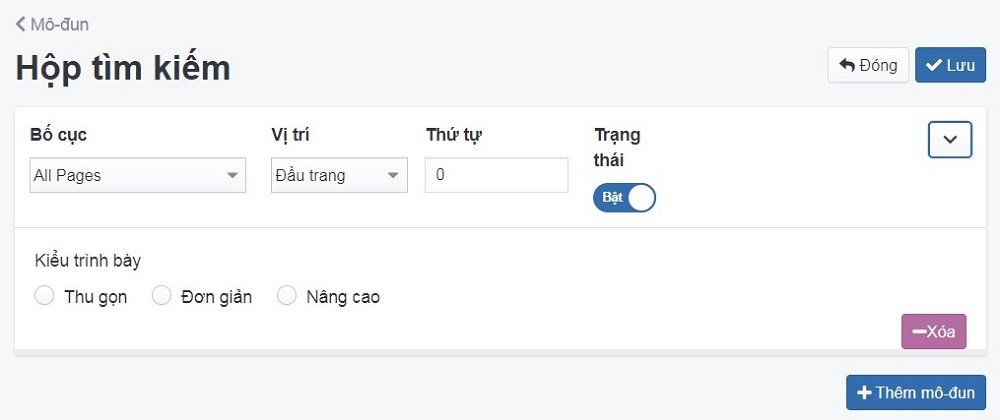

# Mô đun Hộp tìm kiếm

Là khi người dùng thực hiện tìm kiếm trên thanh tìm kiếm, công cụ tìm kiếm có nhiệm vụ trả kết quả có liên quan nhất với truy vấn của người dùng. Quản lý thay đổi công cụ tìm kiếm phù hợp với nhu cầu sử dụng. Trải nghiệm các công cụ tìm kiếm đa dạng hơn.

Để cấu hình mô đun hộp tìm kiếm, bạn cần:

Tại màn hình quản trị, bạn chọn mục **Giao diện -> Mô đun -> Hộp tìm kiếm -> **Cấu hình**

Trang tạo cấu hình mô đun hộp tìm kiếm được mở ra, điền và cấu hình các thông tin chi tiết của danh mục đó.

Những thông tin cần cấu hình như sau:

**Bố cục**
Lựa chọn bố cục hiển thị **All page** cho danh mục hoặc chọn bố cục có sẵn trong box

**Vị trí**
Hiển thị Lựa chọn vị trí hiển thị **Đầu trang** cho danh mục hoặc chọn vị trí có sẵn trong box

**Trạng thái**
Lựa chọn trạng thái hiển thị mô đun (Bật: cho phép hiển thị/Tắt: không cho phép hiển thị)

**Thứ tự**
Xem thêm [tại đây](https://mkmate.osd.vn/docs/common/logic)

**Kiểu trình bày** Có 3 kiểu trình bày

- Thu gọn: hiển thị icon tìm kiếm, khi click vào icon hệ thống sẽ hiển thị khung box điền nội dung tìm kiếm từ khóa

- Đơn giản: hiển thị icon và khung box tìm kiếm từ khóa

Sau khi thay đổi các thông tin - thiết lập của mô đun cần chọn **Lưu** để hoàn tất.

### Xóa mô đun hộp tìm kiếm

Nhấn chọn nút **Xóa** để xóa mô đun này, hệ thống sẽ xác nhận với nội dung như sau: **"Bạn có chắc chắn muốn xóa đối tượng này không? Đây là hành động sẽ không thể khôi phục lại được."**. 

Bạn chọn **Ok** nếu xác nhận xóa.

### Sửa mô đun hộp tìm kiếm

Để sửa cấu hình, bạn cần nhấn chọn **Giao diện -> Mô đun -> Hộp tìm kiếm -> Cấu hình**.

Sau khi thay đổi các thông tin - thiết lập của mô đun cần chọn **Lưu** để hoàn tất.
