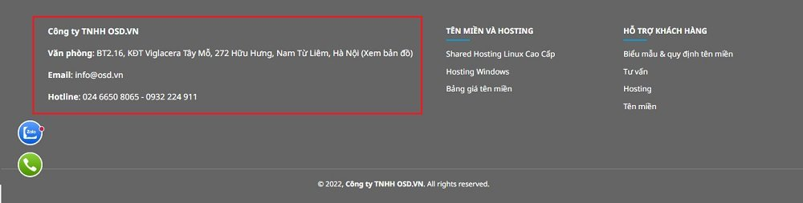

# Quản lý mô đun Nội dung

Cho phép hiển thị các thông điệp tùy chỉnh trên website.

Hình minh họa được hiển thị như sau:

Để cấu hình mô đun Nội dung, bạn cần:

**Bước 1** Tại màn hình quản trị, bạn chọn mục **Giao diện => Mô đun => Nội dung**

**Bước 2** Nhấp chuột vào nút **Cấu hình**

**Bước 3** Trang tạo cấu hình mô đun Nội dung được mở ra, điền và cấu hình các thông tin chi tiết của danh mục đó.

Những thông tin cần cấu hình như sau:

**Nội dung** Nhập thông tin cần hiển thị ví dụ như địa chỉ website, thông điệp muốn hiển thị trên website

**Bố cục** Lựa chọn bố cục hiển thị **All pages** cho danh mục hoặc chọn bố cục có sẵn trong box

**Vị trí** hiển thị Lựa chọn vị trí hiển thị **Trình đơn chân trang** cho danh mục hoặc chọn vị trí có sẵn trong box

**Trạng thái** Lựa chọn trạng thái hiển thị mô đun (Bật: cho phép hiển thị/Tắt: không cho phép hiển thị)

**Thứ tự** Đánh thứ tự hiển thị cho mô đun (với số 0 là số lớn nhất được hiển thị đầu tiên)

Sau khi thay đổi các thông tin - thiết lập của mô đun cần chọn **Lưu** để hoàn tất.
