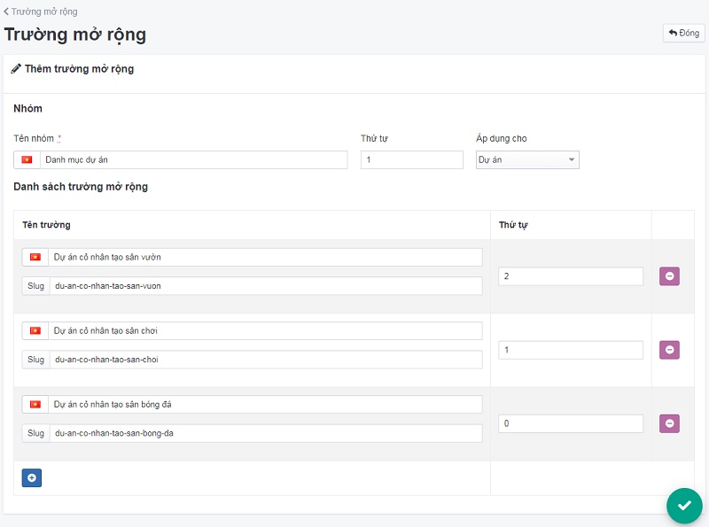
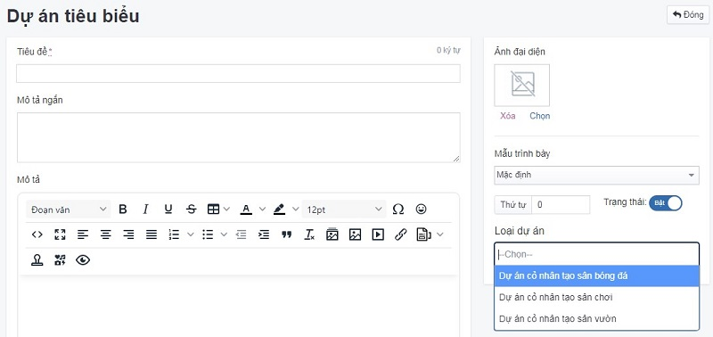

# Trường mở rộng

Áp dụng cho nhóm nội dung `Dự án`, `Thư viện ảnh` có nhiều phân loại nhóm

## Thêm mới trường mở rộng

Để thêm một bài dự án tiêu biểu, bạn cần:

Nhấn chọn **Hệ thống -> Quản lý mẫu -> Trường mở rộng**. Nhấn chọn nút (+) để thêm mới 1 mục.

Những thông tin cụ thể cần điền như sau:

**Tên nhóm**

Điền tên nhóm nội dung. Được hiển thị tại vùng chức năng [Nội dung -> Dự án tiêu biểu](https://mkmate.osd.vn/docs/catalog/portforlio)

**Thứ tự**

Sắp xếp thứ tự cho nhóm nội dung

Xem thêm [tại đây](https://mkmate.osd.vn/docs/common/logic#th%E1%BB%A9-t%E1%BB%B1-s%E1%BA%AFp-x%E1%BA%BFp-l%C3%A0-s%E1%BB%91-ch%E1%BB%89-%C4%91%E1%BB%8Bnh)

**Áp dụng cho**

Lựa chọn các tùy chọn có sẵn `Dự án`, `Thư viện ảnh, `Sản phẩm`. 

**Tên trường**

**Thứ tự**

Sắp xếp thứ tự cho trường mở rộng

Xem thêm [tại đây](https://mkmate.osd.vn/docs/common/logic#th%E1%BB%A9-t%E1%BB%B1-s%E1%BA%AFp-x%E1%BA%BFp-l%C3%A0-s%E1%BB%91-ch%E1%BB%89-%C4%91%E1%BB%8Bnh)
