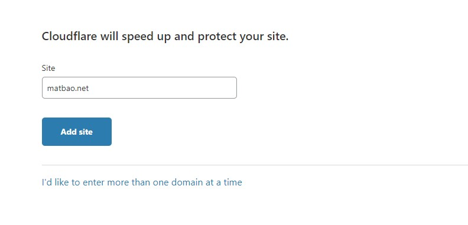
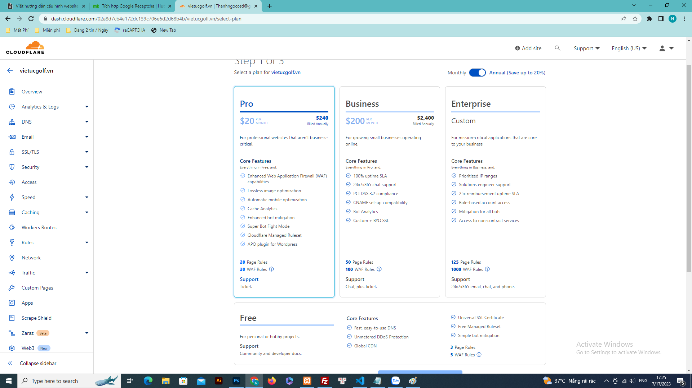
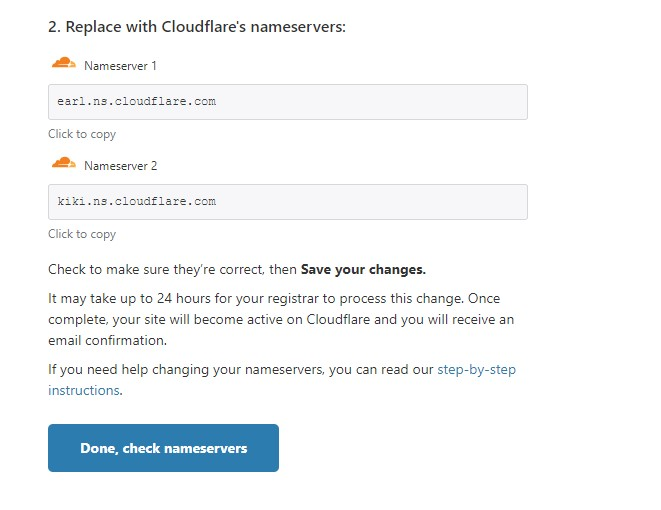
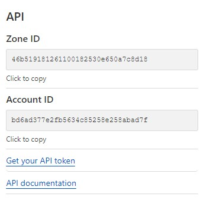

# Hướng dẫn tích hợp tên miền sử dụng DNS của Cloudflare
Truy cập đường dẫn https://dash.cloudflare.com/ nếu bạn chưa có tài khoản thì bạn đăng kí tài khoản [tại đây](https://dash.cloudflare.com/sign-up).

## Đăng nhập Cloudflare

Sau khi đăng nhập nếu bạn chưa đăng kí website nào sẽ hiện lên **Add site**.

Thêm website vào cloudflare

Chọn gói dịch vụ, ở đây bạn chọn gói miễn phí.

Bạn nhấn chọn vào vùng **Free** để dùng miễn phí sau đó nhấn chọn **Continue**.Tiếp đó bạn chọn **Continue**

Trỏ cặp nameserver về cloudflare

Tiếp đó bạn quay trở lại trang cloudflare sau đó chọn Done, checknameserver. Tại đây bạn nhấn chọn **get started** và sau đó chọn liên tiếp vào **save**. Sau đó bạn đợi trong vòng 24h để nhà cung cấp xử lí. Khi trang web hoạt động trên cloudflare sẽ có 1 thông báo gửi đến email của bạn.

## Hướng dẫn tích hợp web vào cloudflare

Truy cập vào quyền quản trị website nhấn chọn **Hệ thống -> Tích hợp -> Cloudflare DNS Proxy**. 

Sau đó truy cập vào cloudflare.

Dán mã **Zone id** vào trường **Zone id**, copy trường **Account id** vào trường **Token id**.

Sau khi tích hợp xong, nhấn chọn **Công cụ -> Xóa đệm Cloudflare** để xóa cache cloudflare.

