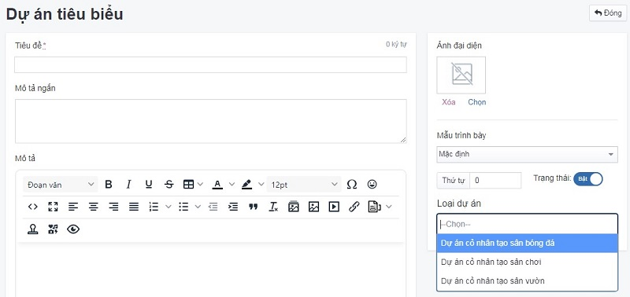

# Trường mở rộng

Áp dụng cho nhóm nội dung `Dự án`, `Thư viện ảnh` có nhiều phân loại nhóm khác nhau.

## Thêm mới trường mở rộng

Để thêm một bài dự án tiêu biểu, bạn cần:

Nhấn chọn **Hệ thống -> Quản lý mẫu -> Trường mở rộng**. Nhấn chọn nút **Thêm** để thêm mới 1 mục.

Những thông tin cụ thể cần điền như sau:

**Tên nhóm**

Điền tên nhóm nội dung của trường mở rộng. Được hiển thị tại vùng chức năng [Nội dung -> Dự án tiêu biểu](https://mkmate.osd.vn/docs/catalog/portforlio)

**Thứ tự**

Sắp xếp thứ tự cho nhóm nội dung mở rộng.

Xem thêm [tại đây](https://mkmate.osd.vn/docs/common/logic#th%E1%BB%A9-t%E1%BB%B1-s%E1%BA%AFp-x%E1%BA%BFp-l%C3%A0-s%E1%BB%91-ch%E1%BB%89-%C4%91%E1%BB%8Bnh)

**Áp dụng cho**

Lựa chọn các tùy chọn có sẵn `Dự án`, `Thư viện ảnh`, `Sản phẩm`. Đối với nhóm nội dung có nhiều phân loại nhóm sẽ thao tác tạo trường mở rộng.

**Tên trường**

Điền tên trường mở rộng

**Thứ tự**

Sắp xếp thứ tự cho trường mở rộng

Xem thêm [tại đây](https://mkmate.osd.vn/docs/common/logic#th%E1%BB%A9-t%E1%BB%B1-s%E1%BA%AFp-x%E1%BA%BFp-l%C3%A0-s%E1%BB%91-ch%E1%BB%89-%C4%91%E1%BB%8Bnh)

**Slug**

Xem thêm [tại đây](https://mkmate.osd.vn/docs/seo/serp#slug-url-th%C3%A2n-thi%E1%BB%87n)

- Nhấn chọn nút (+) để thêm nhiều trường mở rộng
- Nhấn chọn nút (-) để xóa trường mở rộng

Nhấn chọn nút **Lưu** để lưu lại 1 mục.

## Xóa trường mở rộng

Để xóa một trường mở rộng, tích vào trường mở rộng đó và nhấn chọn nút **Xóa** từ danh sách thả xuống.

Xem thêm [tại đây](https://mkmate.osd.vn/docs/common/logic#x%C3%B3a-c%C3%A1c-m%E1%BB%A5c-c%C3%A1c-th%C3%A0nh-ph%E1%BA%A7n-th%C3%B4ng-tin)

## Sửa trường mở rộng

Để sửa trường mở rộng, nhấn chọn vào bài trường mở rộng đó để sửa.

Sau khi thay đổi các thông tin nội dung của trường mở rộng, nhấn chọn nút **Lưu** để cập nhật những thay đổi.
