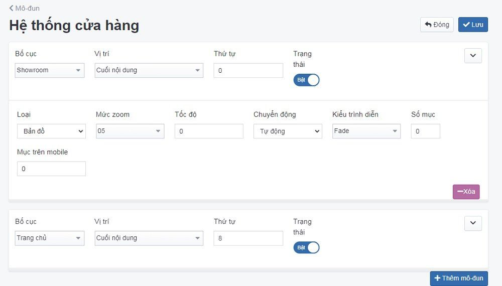
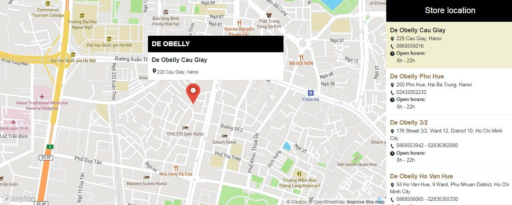

# Quản lý Hệ thống cửa hàng

Cấu hình một hệ thống kinh doanh theo chuỗi gồm từ hai hay nhiều hơn cửa hàng được sở hữu và quản lí tập trung

Để cấu hình mô đun hệ thống cửa hàng, bạn cần:

**Bước 1** Tại màn hình quản trị, bạn chọn mục **Giao diện => Mô đun => Hệ thống cửa hàng**

**Bước 2** Nhấp chuột vào nút **Cấu hình**

**Bước 3** Trang tạo cấu hình mô đun hệ thống cửa hàng được mở ra, điền và cấu hình các thông tin chi tiết của danh mục đó.

Những nội dung cần điền như sau:

**Bố cục** Lựa chọn bố cục hiển thị **Liên hệ** cho danh mục hoặc chọn bố cục tại danh sách thả xuống có sẵn trong box

**Vị trí** hiển thị Lựa chọn vị trí hiển thị **Cuối nội dung** cho danh mục hoặc chọn vị trí tại danh sách thả xuống có sẵn trong box

**Trạng thái** Lựa chọn trạng thái hiển thị mô đun (Bật: cho phép hiển thị/Tắt: không cho phép hiển thị)

**Thứ tự** Đánh thứ tự hiển thị cho mô đun (với số 0 là số lớn nhất được hiển thị đầu tiên)

**Loại** Có 2 loại hiển thị: bản đồ và danh sách

- Loại bản đồ: hiển thị minh họa như sau:

- Loại danh sách: được hiển thị theo list danh sách các điểm cửa hàng

**Mức zoom**

**Tốc độ**

**Chuyển động** Có 2 kiểu chuyển động: thủ công và tự động

- Thủ công:
- Tự động: 

**Kiểu trình diễn** Có 3 kiểu trình diễn: **Fade, Slide, Look**

**Số mục**

**Mục trên mobile**

**Thêm mô đun** Nhấn chọn để cấu hình thêm nhiều mô đun với bố cục và vị trí khác nhau.

Sau khi thay đổi các thông tin - thiết lập của mô đun cần chọn **Lưu** để hoàn tất.
